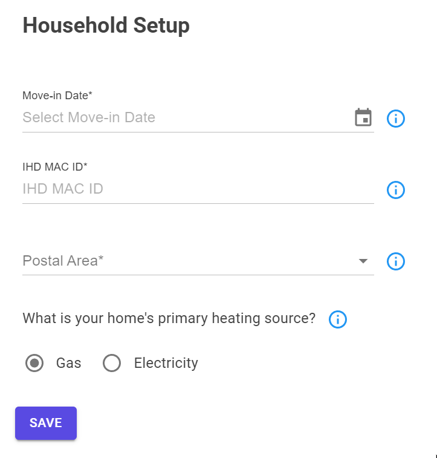
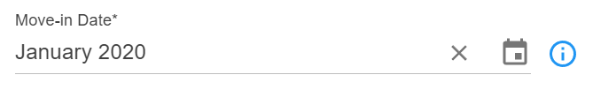
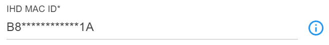
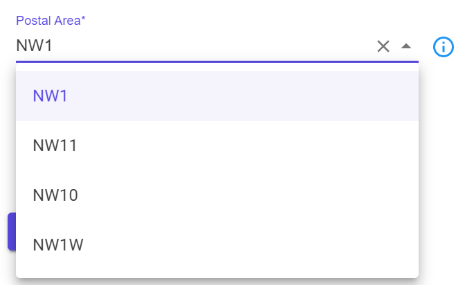
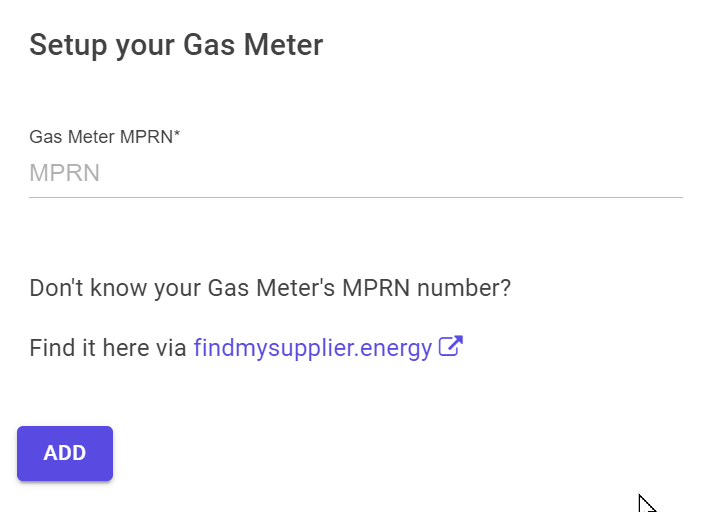

#########################################################################################

<!-- - [Introduction](#Introduction)
- [Household](#Household)
- [Gas Meter](#GasMeter)
- [Electricity Meter](#ElectricityMeter)
- [Meter Authorization](#MeterAuthorization)
- [Energy Tariffs](#EnergyTariffs)
 -->

## Introduction 

The setup process is relatively straightforward, but there are a few things to be aware of. 

The only piece of information that you the application cannot provide is your smart meter IHD ID. This is a 12-digit number that is printed on the back of the smart meter IHD.

Your energy meter MPAN/MPRN numbers are also required, but these can be obtained through the National Grid lookup service [supplier.nationalgrid.co.uk](https://supplier.nationalgrid.co.uk/) 
and findmysupplier.energy: [findmysupplier.energy](https://www.findmysupplier.energy).

### Setup flow

The setup process proceeds as follows: Household -> Energy Meter (Gas or Electricity, either or both) -> Meter Authorization (required separately for Gas and Electricity) -> Energy Tariffs (optional)

There is a setup 'wizard' that guides you through the process, proceeding as Household -> Gas Meter -> Gas Meter Authorization -> Electricity Meter -> Electricity Meter Authorization -> Final Summary.

However, you can also navigate directly to any of the setup pages, and the wizard will pick up where you left off. If you only have a Gas smart meter, you can skip the Electricity Meter setup, and vice versa.

The setup wizard is available from the main menu and the home page: 

All the wizard does is wrap the setup stages into a single flow. You can navigate directly to 'Setup' from the main menu, where all the setup options are also available.

As soon as you successfully authorize a meter, the application will retrieve data for that meter, and analyse it. This can take a few seconds. 

The following sections describe each of the setup wizard stages, although the same setup screens are available in the /Setup page, and work in the same way. 

## Household 

The first step is to enter your household details. This is a one-off process, and you can change the details at any time, although changing the smart meter IHD ID will require you to re-authorize each meter.

### Move-in date

Select the month you moved in to your current property. This is required for authorization with n3rgy, used to determine the applicable historical tariff rates, and to ensure that only data relevant to your occupancy is used in the analysis.

### Smart Meter IHD ID

This is a 16-digit number that is printed on the back of your smart meter IHD (In-home Display). It is used to authorize a  meter with n3rgy, and to retrieve the meter data. Only you have access to this number, so keep it safe. 

Validation checks are performed on the IHD ID to ensure that it is a valid MAC ID. If you enter an invalid IHD ID, you will be prompted to re-enter it.

### Postal Area

This is the first part of your postcode, e.g. 'SW1A'. It is used to gather historical and forecast weather data for your location.

The input is an auto-complete text field, so you can enter the first two characters of your postal area, and select from the list of matching areas.

 

### Primary Heating source

This is the energy type (Gas or Electric), and hence the energy meter, that is used for your primary heating. In 80% of UK homes, this is Gas, though Electric heating is more common in flats and apartments.

This meter's data will be analysed with respect to your local weather data, to help forecast future consumption based on forecast weather, and further ahead, local climate data. More details on this are documented in the Heating Meter Analysis section here: [Heating Meter Analysis](../Analysis/HeatingMeterAnalysis.md)

### On completion

Once you have entered and saved your household details, the application will automatically retrieve the historical and future weather data for your location. This can take a few seconds.

## Gas Meter 

If you have a Gas smart meter, you can enter the meter details here. If you don't have a Gas smart meter, you can skip this step.

You can find your Gas smart meter MPRN number on your energy bill, or by using the link to the findmysupplier.energy website.

The MPRN number is checked to ensure that it is valid, and that it is a Gas meter. If you enter an invalid MPRN number, you will be prompted to re-enter it.

Once you have entered and saved your Gas meter details, the next step is to authorize the meter with n3rgy.

## Meter authorization 

 you will be prompted to authorize the meter with n3rgy. 